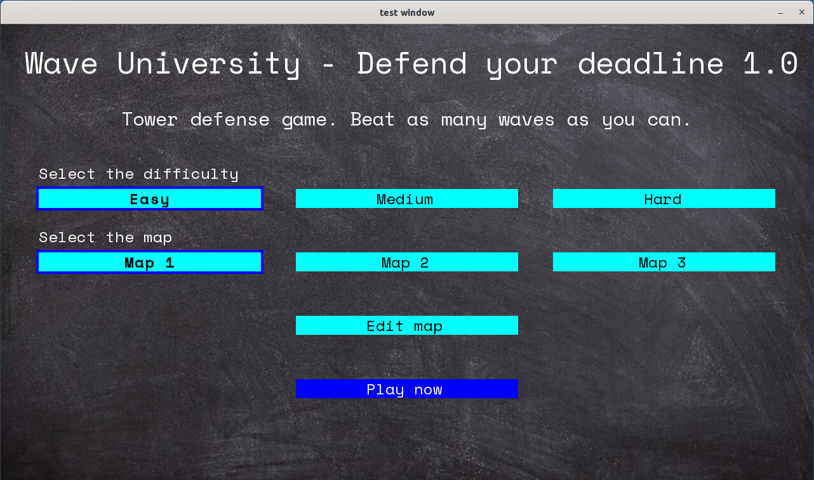
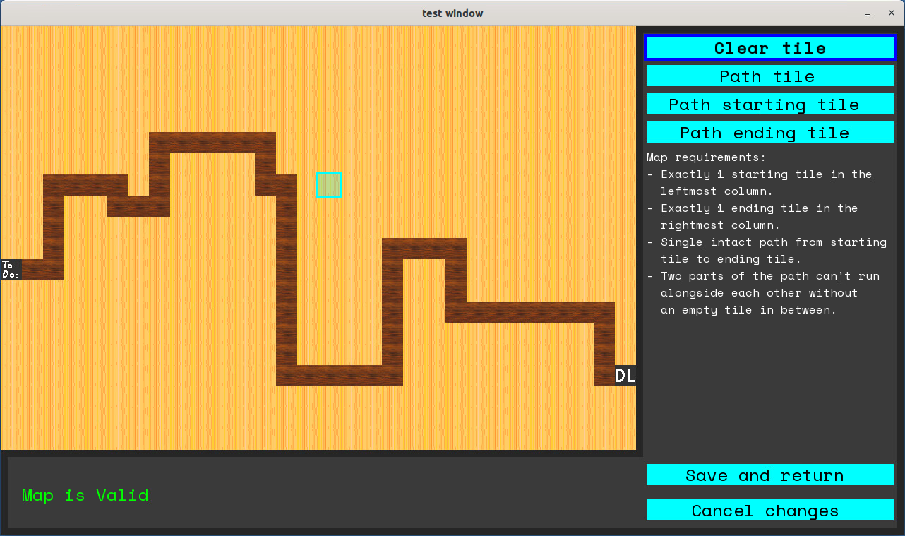
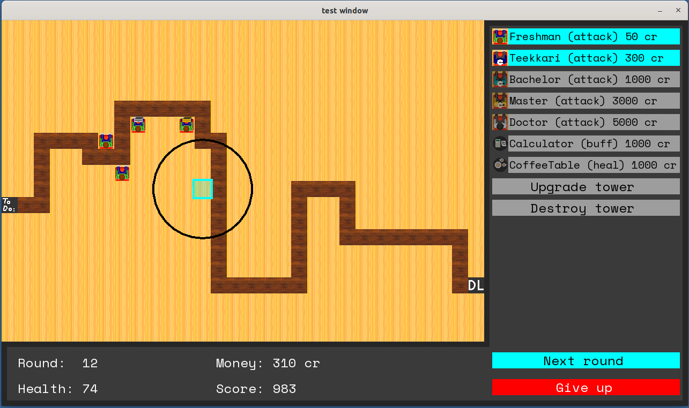
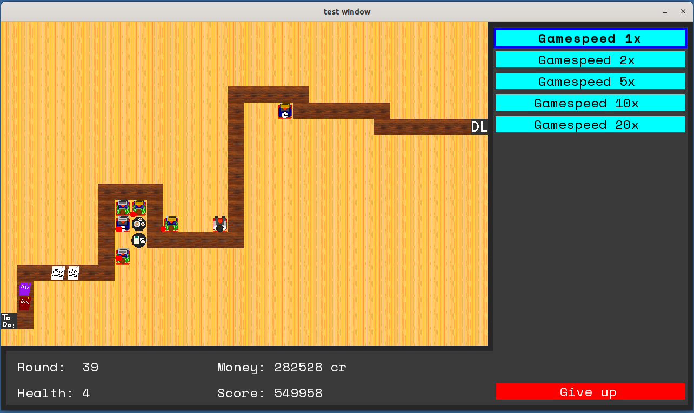

# Tower Defense 2

# Group members
- Elias Peltokangas
- Kabir Bissessar
- Juho Poteri
- Antti Pekkanen

# Overview

**Goal:** create a Tower Defense game, using C++

“Tower defense (or informally TD) is a subgenre of strategy video game where the goal is to defend a player’s territories or possessions by obstructing enemy attackers, usually achieved by placing defensive structures on or along their path of attack.”  

In a tower defense game, the enemies move in waves from some position of the map to another. The goal of the player is to place towers on their path in order to block, impede, attack or destroy the enemies before they are able to reach their goal. The primary object is the survival of the base.

The theme of this game is "Wave University" - where students try to complete the assignments

## Features of the project

### Minimum Requirements

- Functioning tower defense game
- Basic graphics
- At least three different types of towers
- At least three different types of enemies
- At least five different levels, with increasing difficulty
- Game can be controlled with mouse input
- User interface which shows player information e.g. Score, Money, Health

### Additional Features Implemented

- Non-hardcoded maps - maps can be read from files
- Upgradeable towers
- Level editor - maps can be edited using GUI
- High scores list
- Towers can be damaged by enemies
- Sound effects


# Building instructions

This project was built and tested using Linux. It is also possible to run using WSL on Windows 11, however WSL on Windows 10 does not support it.

```shell
# Download the repository
git clone git@version.aalto.fi:bissesk1/tower-defense-2.git
cd tower-defense-2

# Build the project
cmake -B ./build
make -C ./build

# Start the game
./build/tower-defense
```

The library SFML was used to build this game. It can be installed using 

```shell
sudo apt-get install libsfml-dev
```

# Project Structure

- doc/ -- This folder contains the documentation of the project

- images/ This folder contains media (.png .wav) files necessary for the project 

- plan/ -- This folder contains the project plan, created at the start of the project

- src/ -- This folder contains the C++ source files for the project.

- tests/ -- This folder contains C++ files used to test the project, during the development stage.


# Using the Software
The game has two main phases: the build phase and wave phase. The game starts with the build phase.

During the build phase, towers can be built, upgraded and/or destroyed on the map. 
When "Next round" is selected, the phase is switched. If the game is in the build phase, the wave phase would then start.

During the wave phase, the enemies spawn from the start tile and follow the path to the end tile. Towers will attack the enemies, if they are in range. 
If the towers kill the enemies, the player gains money and the score increases. However, if enemies survive the towers and make it to the end tile, the player loses health.

The game launches on this screen. 



By selecting a map and clicking "Edit map", the level editor will be opened, where the selected map can be edited using a visual interface :



When difficulty and map can be selected, the game can be started by clicking "Play now".

The game will then enter the build phase, which looks like this :



Towers can be built by selecting a tile, and then clicking the tower type. 

Attack towers will deal damage to enemies.

Buff towers will enhance the damage of Attack towers.

Heal towers will heal Attack towers as they take damage, and revive them if they die.

Towers can be placed on any tile in the game, except the path tiles.
When a tile is selected, the attack range of a tower can be seen by hovering over the tower type.
After a tower is built on the map, it can be upgraded and/or destroyed.

When "Next round" is selected, the game will enter the wave phase, which looks like this :



The wave phase can be sped up by selecting a "Gamespeed".

Some enemies explode into multiple weaker enemies when they are killed. 
When these enemies explode, they will attack the tower that killed them. 
Towers can die as a result of this, which will cause them to stop attacking enemies.

When the player loses all their health, or when "Give up" is clicked, the game ends and the High Score screen is shown.

From there, the player can choose to save their score or go to the main menu.


# Work log

Division of work among group members 

- Elias Peltokangas
  - Implemented non-hardcoded maps - maps can be read from files ()
  - Implemented Level editor
  - Designed towers, enemies, map and path tiles
  - Maintained code to support Doxygen documentation
- Kabir Bissessar 
  - Implemented GUI - sprites, buttons, text
  - Added sound effects
  - Documentation
- Juho Poteri
  - Implemented Enemy Factory - enemies spawned with increasing difficulty
  - Implemented Tower classes - types of towers and how they interact with enemies 
  - Implemented Enemy classes - types of enemies and how they interact with the map/towers 
  - Maintained code to support Doxygen documentation
- Antti Pekkanen
  - Wrote game core - logic that causes game to run
  - Implemented game scoring and high scores list 
  - Player information displayed during game - Score, Money, Health
  - Implemented CMake build  
